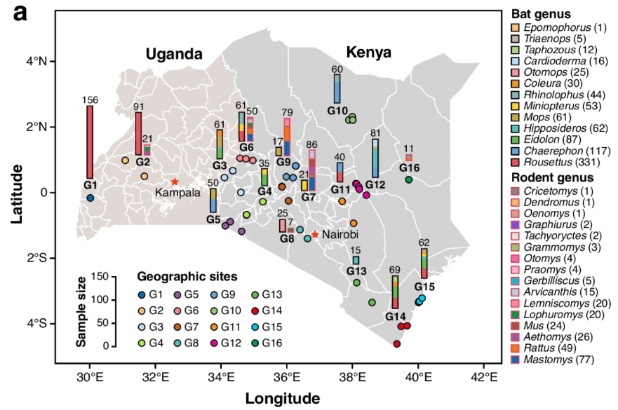

```{r setup, include=FALSE}
#knitr::opts_chunk$set(echo = TRUE)

if (!require("ggplot2"))
  install.packages("ggplot2")

if (!require("dplyr"))
  install.packages("dplyr")

if (!require("readxl"))
  install.packages("readxl")

if (!require("reshape2"))
  install.packages("reshape2")

if (!require("pheatmap"))
  install.packages("pheatmap")

```

# What will we learn in this chapter

-   Explore metadata from a publication
-   Understand Virus coverage and abundance profile
-   Understand and calculate the ecological diversities

# Rapid introduction

Dr. REN and Dr. Wang recently published a comprehensive study that explores the substantial viral diversity in bats and rodents from East Africa (Wang et al.,2024), providing insights into the evolution, recombination, and cocirculation of viruses within these animal populations.



> **Fig.1a** from **Wang, D.**, Yang, X., **Ren, Z.** *et al.* Substantial viral diversity in bats and rodents from East Africa: insights into evolution, recombination, and cocirculation. *Microbiome* **12**, 72 (2024). <https://doi.org/10.1186/s40168-024-01782-4>

It uncovered substantial diversity, with a high degree of geographic specificity and host-related variability among the viruses in East Africa.

While this article went deep into the genomic diversity analysis, it barely addressed the ecological diversity of viral populations. One reason for this is that this study primarily concerned vertebrate viruses, which are relatively scarce in terms of species within a single host, leading to a high sparsity in the overall species abundance matrix.

# Sample information

```{r}
metadata.df <- read_excel("./40168_2024_1782_MOESM1_ESM.xlsx",sheet="S1")

# Individual counts by host and sample type.
table(metadata.df$Sample_Type,metadata.df$Host_Category)
```

# Technical workflow

How we obtained the virus identification as well as quantification profile?

Here is a graphic summary of the technical workflow:


> **Fig.S2 Workflow for virus sequence identification**\
> From *Wang et al.,2024*

# Explore the virus profile

In order to reduce the impact of matrix sparsity, let's take the collection site（GPS column）as the unit, summarize the identified viral taxonomies (vANI95 as OTU) and corresponding abundance (RPKM) for diversity statistics.

```{r}
vir_info.df <- read_excel("./40168_2024_1782_MOESM1_ESM.xlsx",sheet="S3")
# Uniform the Sample_Type writing
vir_info.df$Sample_Type <- gsub(" ","_",vir_info.df$Sample_Type)

# Reshape it to be a 2-dimentional matrix
GPS_vir_info.df <- vir_info.df %>%
  group_by(GPS,vANI95,Host_Category,Sample_Type,Viral_family,Host_species) %>%
  summarise(RPKM = sum(RPKM))
  
  
vir_prof.df <- GPS_vir_info.df %>%
  group_by(GPS,vANI95) %>%
  summarise(RPKM = sum(RPKM)) %>%
  dcast(vANI95~GPS,value.var = "RPKM",fill = 0)

# move the column of vANI95 to the rowname so the table content can be totally numerical.
vir_prof.mat <- vir_prof.df[,2:ncol(vir_prof.df)]
rownames(vir_prof.mat) <- vir_prof.df$vANI95
# Check the head content of this table

vir_prof.mat[1:5,1:5]
```

From this table we will see virus identification and abundance from each site.

So how to grab a landscape view the diversity of those virus?

# Ecological diversity

Diversity in ecology refers to the variety of species within a particular ecosystem or habitat. It is a fundamental concept in ecology and can be measured at different levels (See sections below).

By the way, following diversity indexs will be calculated by `vegan` package, a comprehensive collection of functions dedicated to community ecology, particularly for the analysis of ecological community composition data.

```{r}
# load vegan
if (!require("vegan"))
  install.packages("vegan")
```

**Alpha Diversity (α-diversity)**

Alpha diversity refers to the diversity within a specific community or ecosystem. It is a local measure that includes both species richness (the number of different species) and species evenness (the distribution of individuals among those species). Common metrics for alpha diversity include the Shannon-Wiener index and the Simpson index.

```{r}
div.alpha <- data.frame(
  div.shannon = diversity(vir_prof.mat,index = "shannon",MARGIN = 2),
  div.simpson = diversity(vir_prof.mat,index = "simpson",MARGIN = 2),
  div.invsimpson = diversity(vir_prof.mat,index = "invsimpson",MARGIN = 2)
)
div.alpha$GPS <- rownames(div.alpha)

# attach div.alpha to metadata

div.info.df <- merge(
  unique(metadata.df[,c("GPS","Country","Region","Host_Family","Host_Category")]),
  div.alpha,  by="GPS"
)

# melt 3 catagory of alpha diversity together
div.info.mdf <- melt(div.info.df,measure.vars = c("div.shannon","div.simpson","div.invsimpson"),
                     variable.name = "index_measuremnt",
                     value.name = "diversity_index")

div.info.mdf$Host_Family <- reorder(
  div.info.mdf$Host_Family,
  div.info.mdf$diversity_index, FUN = mean)

# save the order
Host_Family_Order <- levels(div.info.mdf$Host_Family)

ggplot(div.info.mdf,aes(x=Host_Family,y=diversity_index)) + 
  geom_boxplot() + facet_grid(.~index_measuremnt,scales="free")  + 
  coord_flip() + theme_bw()
```

From the above figure, we can gain a basic understanding of the three most commonly used alpha diversity metrics.

### Shannon Index (H')

The Shannon index is a widely used measure of diversity that takes into account both species richness and evenness. It is based on information theory and is sensitive to the presence of rare species.

**Formula:**\
$$ H' = -\sum_{i=1}^{s} p_i \ln(p_i) $$ where $s$ is the number of species, and $p_i$ is the proportion of individuals in the $i$-th species.

> -   High values indicate high diversity.
> -   It is sensitive to evenness, so a community with many rare species will have a higher Shannon index than one with a few dominant species.
> -   The logarithm base can vary, but natural logarithm (base $e$) is commonly used.

### Simpson Index (D)

The Simpson index measures the probability that two individuals randomly selected from the community will belong to the same species. It is sensitive to the abundance of the most common species.

**Formula:**\
$$ D = \sum_{i=1}^{s} p_i^2 $$ where $p_i$ is the proportion of individuals in the $i$-th species.

> -   Values range from 0 (no diversity) to 1 (no richness).
> -   A high value indicates low diversity, as it suggests a high probability of drawing two individuals from the same species.
> -   It is sensitive to the dominance of a few species, so communities with a few dominant species will have a higher Simpson index.

### Inverse Simpson Index (1/D or Q)

The inverse Simpson index, also known as the Gini-Simpson index, is the reciprocal of the Simpson index. It is used to express diversity in a way that is more intuitive, with higher values indicating greater diversity.

**Formula:**\
$$ Q = \frac{1}{D} = \sum_{i=1}^{s} \frac{1}{p_i} $$ where $p_i$ is the proportion of individuals in the $i$-th species.

> -   Values range from 1 (no diversity) to infinity (maximum diversity).
> -   It is the inverse of the Simpson index, so a higher value indicates greater diversity.
> -   It is also sensitive to the dominance of a few species, but in the opposite way of the Simpson index.

These indices provide different perspectives on diversity and can be influenced by different aspects of community composition. The choice of which index to use depends on the specific characteristics of the community being studied and the ecological questions being asked.

**Richness**

Richness is a component of alpha diversity that measures the number of different species present in a community or sample. It is a simple count and does not take into account the relative abundance of each species. Richness is often used as a basic descriptor of biodiversity.

```{r}
div.count <- data.frame(
  GPS = colnames(vir_prof.mat),
  div.richness = apply(vir_prof.mat,2,function(x) sum(x!=0))
)

div.info.mdf <- merge(
  div.info.mdf, div.count, by="GPS"
)

ggplot(div.info.mdf,aes(x=Host_Family,y=div.richness)) + 
  geom_boxplot() + coord_flip() + theme_bw()
```

**Evenness**

Evenness is another component of alpha diversity that describes how evenly the individuals are distributed among the different species in a community. A community with high evenness has a more equal distribution of individuals among species, whereas a community with low evenness has a few dominant species and many rare species. Evenness can be calculated using the formula:

$$E = (H' / Hmax)$$where H' is the diversity index (like the Shannon index) and Hmax is the maximum possible value of H'.

```{r}
div.even.df <- div.info.mdf %>%
  filter(index_measuremnt=="div.shannon") %>%
  transform(evenness=diversity_index/max(diversity_index))

ggplot(div.even.df,aes(x=Host_Family,y=evenness)) + 
  geom_boxplot() + coord_flip() + theme_bw()
```

**Beta Diversity (β-diversity)**.

Beta diversity, also known as true diversity or gamma-alpha difference, measures the diversity between communities or ecosystems. It quantifies the difference in species composition or the turnover of species as you move from one community to another.

Beta diversity can be thought of as the rate at which species change from one area to another. It is often calculated as the difference between gamma diversity (the total species diversity in a landscape) and alpha diversity.

```{r}
beta.euclidean.dist <- vegdist(t(vir_prof.mat), method = "euclidean")
beta.bray.dist <- vegdist(t(vir_prof.mat), method = "bray")
beta.jaccard.dist <- vegdist(t(vir_prof.mat), method = "jaccard")

div.alpha$GPS <- rownames(div.alpha)

#prepare corresponding metadata
metadata.df$Region0 <- sapply(strsplit(metadata.df$Region, ","), `[`, 2)
beta.meta.df <- merge(
  data.frame(GPS=attr(beta.euclidean.dist,"Label")),
  unique(metadata.df[,c("GPS","Country","Region0")]),
  by="GPS",all.x=T,no.dups=T)

beta.meta.df <- beta.meta.df[!duplicated(beta.meta.df$GPS),]
rownames(beta.meta.df) <- beta.meta.df$GPS

pheatmap(beta.bray.dist,
         annotation_row = beta.meta.df[,c("Region0"),F])

pheatmap(beta.jaccard.dist,
         annotation_row = beta.meta.df[,c("Region0"),F])

pheatmap(beta.euclidean.dist,
         annotation_row = beta.meta.df[,c("Region0"),F])
```

Beta diversity reflects the similarity of viral taxonomic diversity among different samples/ regions, with smaller distance values indicating a higher degree of similarity. Therefore, it is essentially a distance matrix. For details on different distance algorithms, you can find their formulas by typing \`?vegdist\` in the console.

```{r}
?vegdist
```
